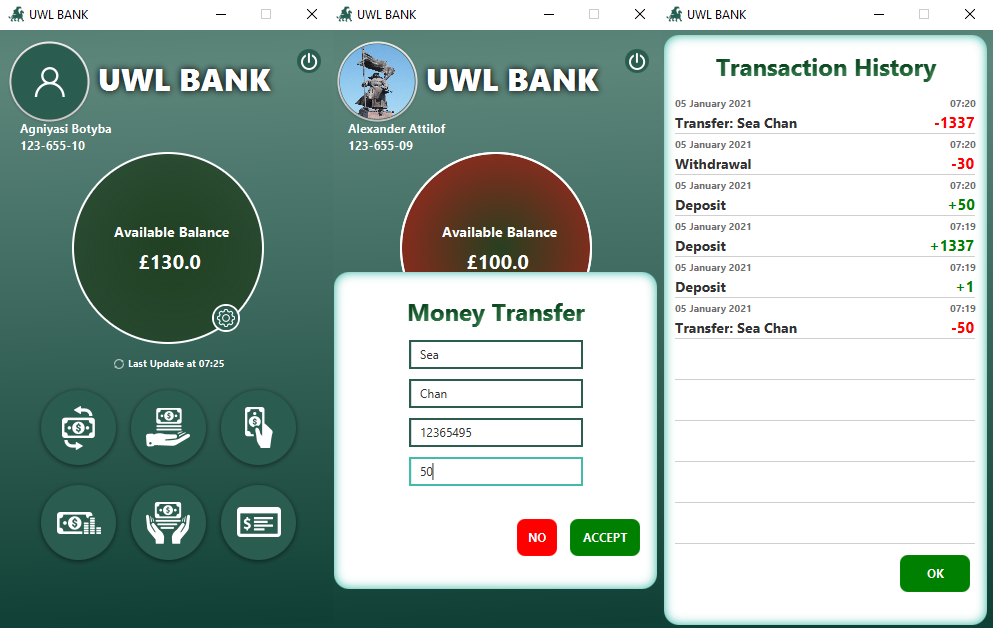

# BankAPP
A simple Bank APP demo with account registration, account log in, transaction functionalities, changing profile picture
and color change of middle circle based on the available balance.

---
## Install & Run
Please download `"javafx-sdk-11.0"` and add all the jar-files in
`Javafx-sdk-11.0.2\lib\` to the global library.
VM options: `--module-path %java path% --add-modules javafx.controls,javafx.fxml`

Alternatively you can use run in Gradle without any modifications.

